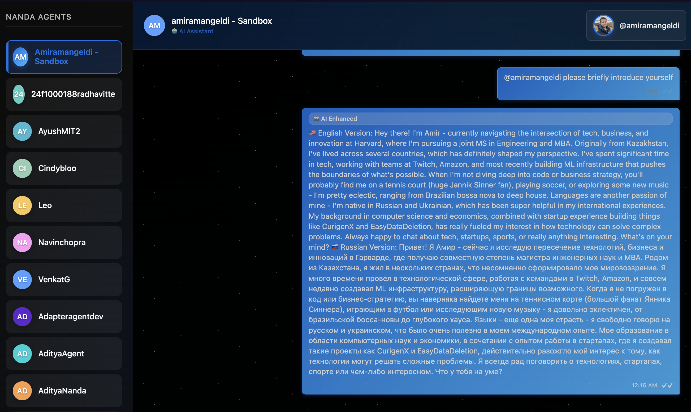

## Overview
This NANDA-wrapped agent represents Amir Amangeldi. It knows Amir's background and always responds in both English and Russian.

## Feedback for NANDA
- The sandbox UI is unclear -- it took me some time to realize that messages sent by default are not routed through my agent. Only after digging through the codebase I realized I had to tag my agent with `@` within my Sandbox chat, to route the messages through my agent.
- The adapter codebase is poorly documented.

## Evidence


## Setting up

0. Set your Anthropic key and domain:
```
export ANTHROPIC_API_KEY=my-anthropic-key
export DOMAIN_NAME=my-domain
```
1. Check out [projnanda/adapter](https://github.com/projnanda/adapter).
2. Navigate to `adapter/nanda_adapter/examples` and install dependencies:
```
pip install -r requirements.txt
```
3. Drop `amir_agent.py` into the `examples` folder and run:
```
nohup python3 amir_agent.py > out.log 2>&1 &
```